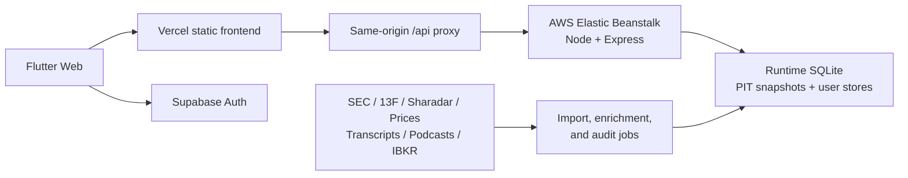

<div align="center">
  
  <h1>ThesisForge</h1>
  <p><strong>Point-in-time public-equity research and private portfolio intelligence.</strong></p>
  <p>
    Follow great investors, replay what the market knew, value companies from
    reported fundamentals, and monitor a real portfolio in one research terminal.
  </p>
  <p>
    <a href="https://thesisforge.tech"><strong>Open the terminal</strong></a>
    &nbsp;&middot;&nbsp;
    <a href="docs/deployment-contract.md">Deployment contract</a>
  </p>
  <p>
    
    
    
    
    
  </p>
</div>


<p align="center"><sub>Valuation Market Map: browse the research universe by industry, valuation gap, and model quality.</sub></p>

## The Product

ThesisForge is a buy-side research workspace built around a simple idea:
every conclusion should be traceable to what was actually knowable at that
moment.

It connects public filings, 13F portfolios, insider activity, point-in-time
financials, management guidance, earnings-call Q&A, market prices, podcast
commentary, and user-linked brokerage data without turning the experience into
a collection of disconnected dashboards.

The interface is bilingual, responsive, and intentionally dense. It is designed
for repeated research work rather than a marketing landing page.

## Research Surfaces

| Surface | What it answers | Key workflows |
| --- | --- | --- |
| **Guru** | What are high-conviction investors doing? | 13F and Form 4 tracking, new buys and exits, position history, quarterly contribution, portfolio-vs-SPY simulation, signal board, crowded holdings |
| **Ontology** | Where are fundamental inflections appearing? | Point-in-time event signals, peer confirmation, industry graphs, decision replay, strategy comparison, model holdings |
| **Valuation** | What is a company worth using only visible inputs? | Industry market map, historical fair value, quarterly research cards, economic-profile models, earnings-call Q&A, management guidance, podcast evidence |
| **Portfolio** | How does the user's real book look now? | Encrypted IBKR/Yodlee sync, NAV history, holdings and allocation, cash flows, valuation gaps, dividends, Sharpe and scenario analytics |
| **Admin** | Is the platform and its data healthy? | User portfolio audit, data-job health, backend status, refresh controls, account drilldown |

## ThesisForge


The Guru workspace brings manager selection, filing metadata, holdings changes,
backtests, and cross-manager signals into one scan-friendly view. Public filing
data remains separate from private user portfolio data.

## Point-In-Time Valuation

Valuation nodes are historical research decisions, not present-day estimates
painted backward onto old dates.

- Financials use the earliest available filing record for each fiscal period.
- Management guidance must have been observable on or before the model date.
- Market price is a comparison output and is excluded from fair-value inputs.
- Methods vary by economic profile; banks, insurers, software companies,
  cyclicals, and asset managers do not share one generic DCF.
- Every model node retains its financial source, guidance evidence, method
  outputs, assumptions, weights, and price-at-date.
- Release checks reject future-dated inputs, unexplained history gaps,
  non-positive prices, invalid DCF bounds, and non-deterministic rebuilds.

For a growth company, a quarterly research card may combine an EV/sales equity
value, normalized earnings power, and a five-year FCFE DCF. The exact weights
and assumptions are visible in the product rather than hidden behind a single
target price.

## System Architecture



The deployment boundary is deliberate:

- Vercel owns the public Flutter frontend.
- AWS Elastic Beanstalk owns the API and runtime data.
- Both `thesisforge.tech` and `www.thesisforge.tech` point to the same Vercel
  production deployment.
- The browser calls only same-origin `/api/*`; AWS is not compiled into the
  Flutter bundle.
- Supabase service-role credentials and brokerage credentials never enter the
  client.

Read [the deployment contract](docs/deployment-contract.md) before changing
DNS, Vercel, AWS, CI, CORS, or API routing.

## Local Development

### Requirements

- Flutter SDK
- Node.js and npm
- Local environment variables based on `.env.example`

```bash
npm install
flutter pub get
npm run dev
```

| Service | Local URL |
| --- | --- |
| Flutter web client | `http://127.0.0.1:5174` |
| Express API | `http://127.0.0.1:8787` |

Local development uses the explicit backend-only auth bypass. Production must
use Supabase authentication and must never ship development bypass settings.

### Quality Gates

```bash
flutter analyze
flutter test
node --test server/*.test.js
node --test server/retiredProductRoutes.test.js server/backendPackaging.test.js server/caddyRetirement.test.js
npm run test:proxy
npm run build
```

PIT valuation releases have an additional deterministic audit:

```bash
node server/verifyPitValuationRelease.js baseline.sqlite run1.sqlite run2.sqlite
```

## Common Operations

```bash
# Build the Vercel frontend
npm run build

# Package the API for Elastic Beanstalk
npm run package:aws

# Refresh dividend data
npm run refresh:dividends

# Audit valuation coverage and model quality
npm run audit:valuation

```

Operational rules for 13F refreshes, valuation migrations, AWS publication,
and frontend deployment live in [AGENTS.md](AGENTS.md).

## Representative API

| Route | Purpose |
| --- | --- |
| `GET /api/health` | API, database, and data-job health |
| `GET /api/gurus` | Guru universe and dashboard payload |
| `GET /api/gurus/:id/backtest` | Manager portfolio-vs-SPY simulation |
| `GET /api/strategies` | Ontology strategy research catalog |
| `GET /api/decision/snapshot` | Historical point-in-time decision state |
| `GET /api/valuation` | Fair-value market map |
| `GET /api/valuation/:ticker` | Ticker history, model book, Q&A, and evidence |
| `GET /api/portfolio` | Authenticated user's portfolio cockpit |
| `POST /api/portfolio/sync` | Refresh linked portfolio data |
| `GET /api/admin/system-health` | Admin-only operational health |

Protected routes require a valid Supabase-authenticated request in production.

## Repository Guide

| Path | Responsibility |
| --- | --- |
| `lib/main.dart` | Flutter terminal UI and responsive workflows |
| `server/` | Express API, models, clients, importers, audits, and tests |
| `api/proxy.js` | Vercel same-origin proxy to AWS |
| `scripts/` | Build, deployment, refresh, migration, and audit tooling |
| `web/ontology/` | Authenticated Ontology research explorer |
| `web/guru-avatars/` | Public manager avatar assets |
| `docs/` | Architecture, deployment, and audit documentation |

## Security And Data Boundaries

- Portfolio data is scoped to the authenticated user.
- IBKR/Yodlee credentials are encrypted and stored only on the backend.
- Admin routes are restricted to configured admin identities.
- Account deletion removes user-owned portfolio data before Auth deletion.
- Runtime databases, paid datasets, secrets, and user records are not committed
  to Git.

## Status

ThesisForge is an active private product build. The responsive web
terminal is the current production surface.

> **Research software, not investment advice.** Model outputs depend on source
> quality and stated assumptions. They should be reviewed as research evidence,
> not treated as an instruction to buy or sell a security.
